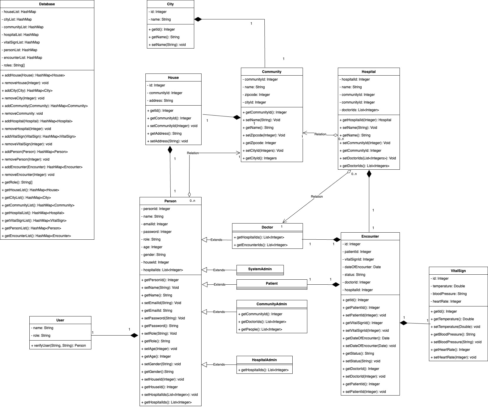
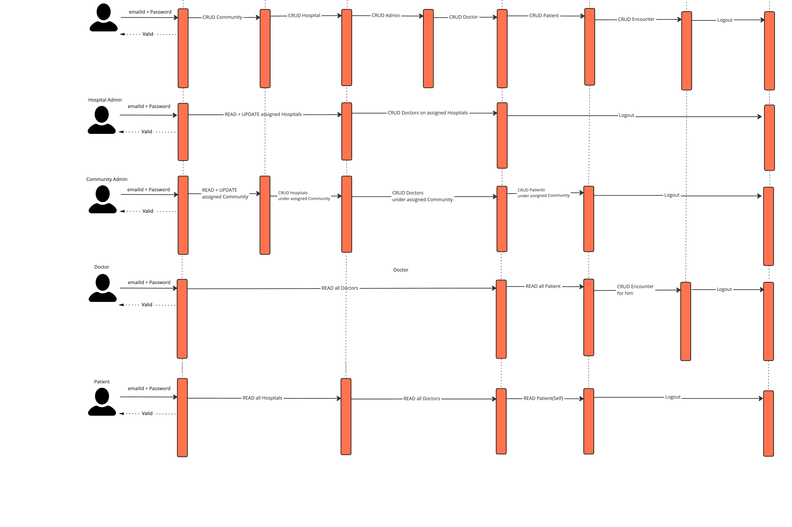

Medical Resource System - Sanjevani

A platform to manage Medical Resources in different city and community.

UML Class Diagram 

Sequence Diagram 

Main highlights are as following - 

- Functionalities supported by the platform are as following -
  - Login - Validate credential to allow role based functionality.
  - CRUD - Hospital, Community, Patient, Doctor, Encounter and Admins - System, Hospital and Community.
- Platform supports 5 different Roles -
   1. System Admin - It has full access of the platform.
   2. Hospital Admin - Can CRUD assigned hospitals and doctors directory. 
   3. Community Admin - Can CRUD only one assigned community and update Doctors & Patients under it.
   4. Patient - Can view Doctors & Hospital directory.
   5. Doctor - Can view Doctors directory & Patients directory treated by him. Doctor can also create new Encounter for patient.

Tech Stack 
- Java + Swing UI

IDE Used 
- NetBeans

How to run
- Open project in NetBeans
- Run project or Press F6

